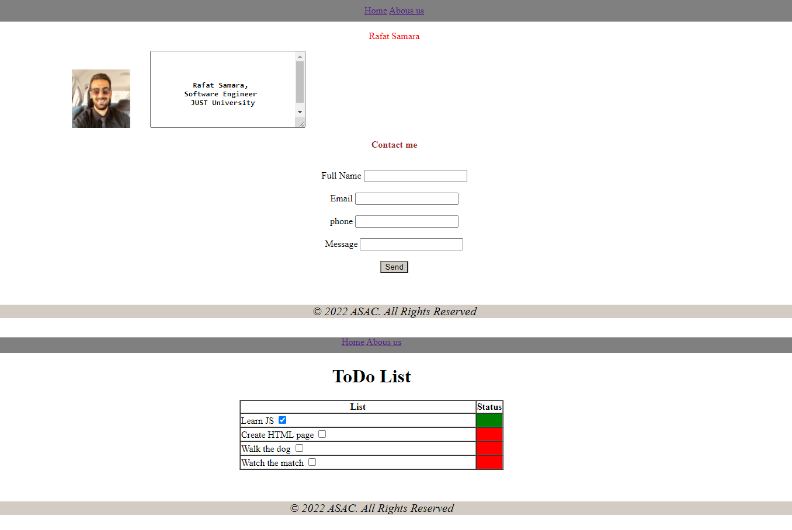
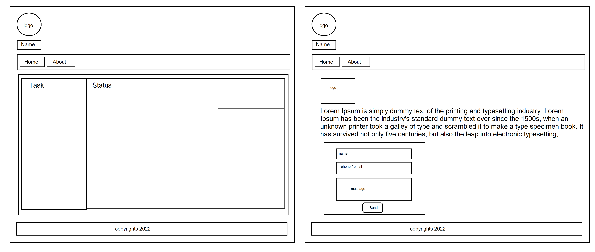

# todo-project

# CSS Project

1. What observations or questions do you have about what you’ve learned so far?
- Nothing, everything is going well
2. How long did it take you to complete this assignment? And, before you started?
- 30 mnts
3.  how long did you think it would take you to complete this assignment?
- around 1 day and 30 mnts :$
    
---
---
# HTML Project

1. What observations or questions do you have about what you’ve learned so far?
- Nothing, everything is going well
2. How long did it take you to complete this assignment? And, before you started?
- 30 mnts
3.  how long did you think it would take you to complete this assignment?
- around 30 mnts :$ 
    